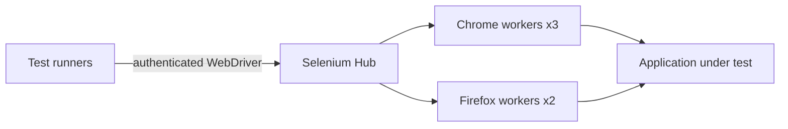

# Selenium Grid on Kubernetes

[](https://github.com/imos64/selenium-grid-kubernetes/actions/workflows/validate.yaml)
[](https://kubernetes.io/)
[](https://helm.sh/)
[](terraform/)
[](opentofu/)

Maintained by [imos64](https://github.com/imos64). A public deployment package with pinned sources, native Kubernetes manifests, Helm, Terraform and OpenTofu, architecture documentation, and recovery runbooks. It follows the structure of [prometheus-kubernetes](https://github.com/imos64/prometheus-kubernetes/tree/main).

## Architecture

A Selenium Hub routes sessions to browser workers. Base runs one Chrome worker; production runs three Chrome and two Firefox workers with shared-memory volumes.



Browser workers scale horizontally; sessions are not migratable after worker loss. The Hub is a singleton in this package, so Hub loss interrupts active sessions. Test runners must retry at the test boundary. Scaling browser pods does not imply session durability.

## Delivery paths

| Path | Purpose |
| --- | --- |
| `charts/selenium` | Local Helm chart and base/production values |
| `k8s/base`, `k8s/production` | Reproducible rendered manifests with Kustomize entry points |
| `terraform`, `opentofu` | Alternative Helm release owners on an existing Kubernetes cluster |
| `scripts` | Rendering, schema validation, secret-reference and topology checks |
| `docs` | Architecture, configuration, operations, validation and source provenance |
| `examples` | Deployment-specific integration and recovery examples |

Use **one** delivery path per release. These modules deploy applications to an existing cluster; they do not provision cloud networks, worker nodes, DNS, object storage or a CSI driver. Base is smaller for evaluation, while production increases storage/resources and supported replicas. Neither profile configures your organization's backup destination or proves an availability SLO.

## Prerequisites

- Kubernetes 1.34-compatible APIs, Helm 3, and a working default RWO StorageClass for stateful workloads. Plan storage expansion and volume reattachment; node-local storage cannot survive permanent node loss.
- For three-member clusters, three schedulable workers in appropriate fault domains. Set node/zone placement and storage topology for your environment.
- A CNI that enforces NetworkPolicy. Workload ingress permits this namespace and namespaces explicitly labeled `platform-access=true`; egress is not restricted by the supplied policy. Internal HTTP services need TLS/authentication at your approved access boundary.
- An explicit kubeconfig/context and namespace access. Operator installation additionally requires cluster-scoped CRD/RBAC privileges.
- Existing credentials delivered by your secret manager. No real passwords, certificates, state files or private project configurations are committed.

Allocate browser memory and `/dev/shm` for realistic tests. Grid is an internal remote-code execution surface; restrict ingress to trusted test runners and use TLS at the approved ingress. Basic authentication is enabled and credentials must be supplied in an external secret.

## Quick start

```bash
git clone https://github.com/imos64/selenium-grid-kubernetes.git
cd selenium-grid-kubernetes
export KUBECONFIG=/absolute/path/to/your/kubeconfig
kubectl config current-context
kubectl create namespace selenium
```

Review [configuration and credentials](docs/configuration.md) before installation. `scripts/bootstrap-demo-secrets.py` generates fresh credentials directly in the selected cluster for a disposable evaluation; it refuses to overwrite an existing secret and never prints generated passwords. For production, provision the same keys using your secret-management workflow.

```bash
python3 scripts/bootstrap-demo-secrets.py --context YOUR_CONTEXT
```

### Helm

```bash
helm upgrade --install selenium ./charts/selenium -n selenium \
  -f charts/selenium/values-production.yaml --wait --timeout 15m
```

Add `-f /secure/path/site-values.yaml` last for your storage class, sizing and integrations. Helm's release wait does not prove database quorum or custom-resource readiness; run the acceptance checks below.

### Native Kubernetes

```bash
kubectl apply --server-side -k k8s/production
```

For customized native manifests, edit chart values then run `make render` and review the diff. The rendered namespace/release defaults are `selenium`; re-render intentionally if you change that contract. Helm hook Jobs become ordinary Jobs under kubectl, so check their completion and delete only completed setup Jobs before rerunning changed hooks.

### Terraform or OpenTofu

Both modules use the same pinned local Helm source. They require the namespace and secrets to exist first. Keep state in an encrypted remote backend with locking; state and plans can contain sensitive information.

```bash
terraform -chdir=terraform init
terraform -chdir=terraform plan -var='kube_context=YOUR_CONTEXT' -out=deployment.tfplan
terraform -chdir=terraform apply deployment.tfplan
# OR
 tofu -chdir=opentofu init
 tofu -chdir=opentofu plan -var='kube_context=YOUR_CONTEXT' -out=deployment.tfplan
 tofu -chdir=opentofu apply deployment.tfplan
```

Use `kubeconfig_path` and `values_files` to supply your environment. See `deployment.tfvars.example`. Never manage the same release from Terraform and OpenTofu simultaneously. 

## Access and acceptance

Internal endpoint: **`selenium-hub.selenium.svc.cluster.local:4444`**.

Check authenticated `/status` for ready=true. Create a Chrome WebDriver session, load a test page, read its title and delete the session. Repeat with Firefox in production. Restart a browser worker and verify the test runner retries the interrupted test.

## Operations and recovery

Grid workers are disposable. Keep test definitions, browser versions and capability configuration in Git; export screenshots, videos and reports to object storage from your test runner. There is no application database or durable browser-session backup.

See [operations](docs/operations.md) for backup, restore, upgrade and failure checks. HA replication is not a backup. Retained PVCs do not protect against storage-system failure, accidental deletion or site loss.

## Validation

```bash
python3 -m venv .venv
. .venv/bin/activate
pip install -r requirements-dev.txt
python3 scripts/install-tools.py
export PATH="$PWD/.tools:$PATH"
make render
make validate
```

CI checks deterministic rendering, strict Helm lint, Kubernetes and custom-resource schemas, topology/secret contracts, Terraform/OpenTofu validation and secret scanning. Runtime acceptance and disaster-recovery steps are documented separately in [validation evidence](docs/validation.md); configuration validation is not proof of production readiness.

## Sources and license

This repository owns the integration/deployment code, not the upstream application. [Upstream project](https://github.com/SeleniumHQ/docker-selenium) · [Official documentation](https://www.selenium.dev/documentation/grid/). See [provenance](docs/provenance.md) for pinned versions and SHA-256 chart checksums. Deployment code is Apache-2.0; bundled upstream charts, schemas and container images retain their original licenses. Review application licensing for your use case, especially Nexus, SonarQube, Redis and MongoDB-derived distributions.
