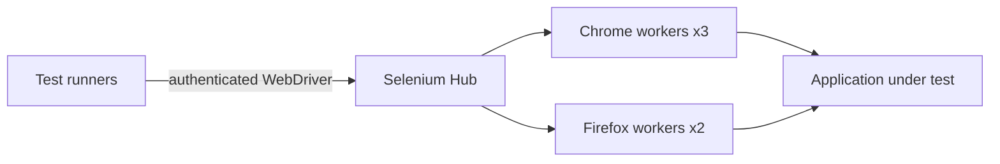

# Architecture

A Selenium Hub routes sessions to browser workers. Base runs one Chrome worker; production runs three Chrome and two Firefox workers with shared-memory volumes.

## Failure domains

Browser workers scale horizontally; sessions are not migratable after worker loss. The Hub is a singleton in this package, so Hub loss interrupts active sessions. Test runners must retry at the test boundary. Scaling browser pods does not imply session durability.

Three pods on one physical host are a development topology, not independent failure domains. Use distinct workers and map placement to zones where your storage and application support it. A node-local PVC binds recovery to that node.

## Trust and data flow

Clients enter through ClusterIP services. Namespace-scoped NetworkPolicies limit workload ingress when enforced by the CNI. Operators need Kubernetes API access and admission-webhook reachability. Existing secrets are mounted or referenced at runtime; never place secret payloads in Helm values or IaC state intentionally.

## Capacity

Base and production resource/PVC requests are explicit in chart values. Benchmark your data volume, query mix and failover headroom. Leave enough capacity to recover a member while sustaining workload; do not treat requests as a sizing guarantee.
